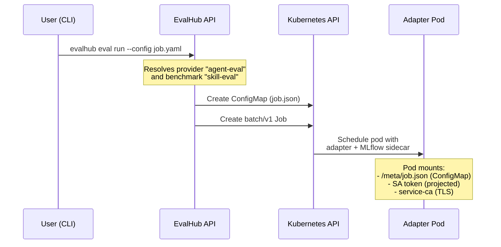
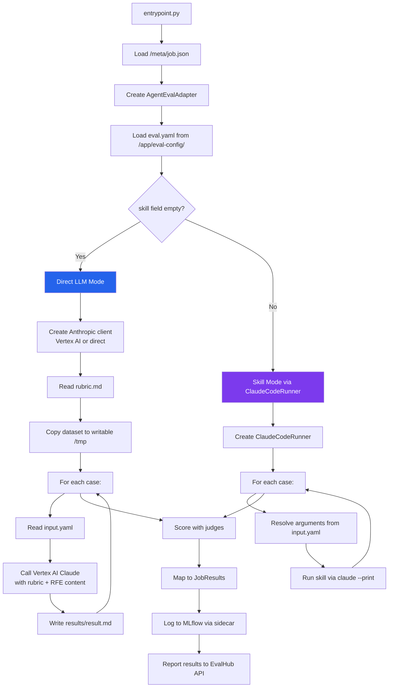
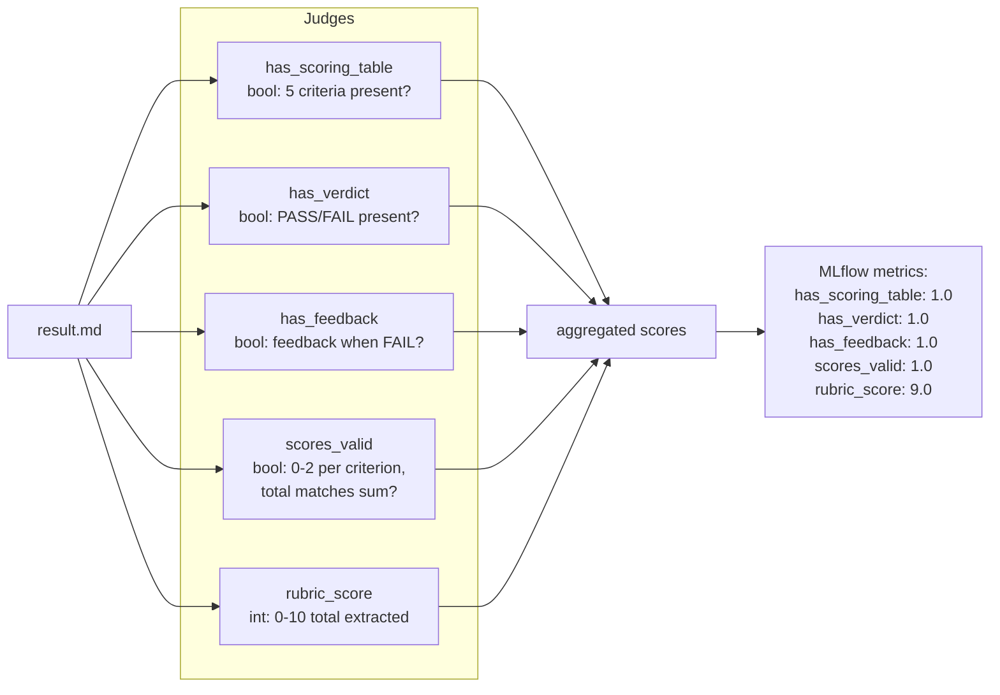
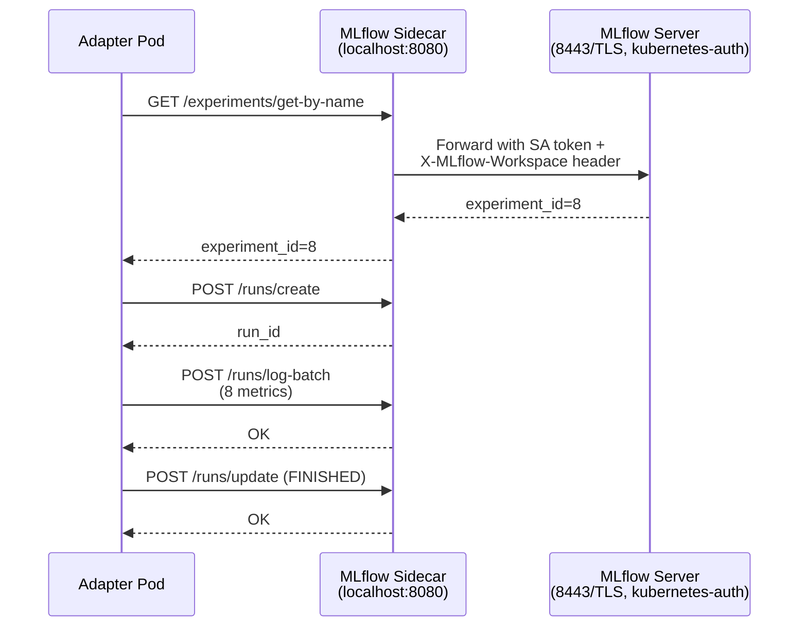
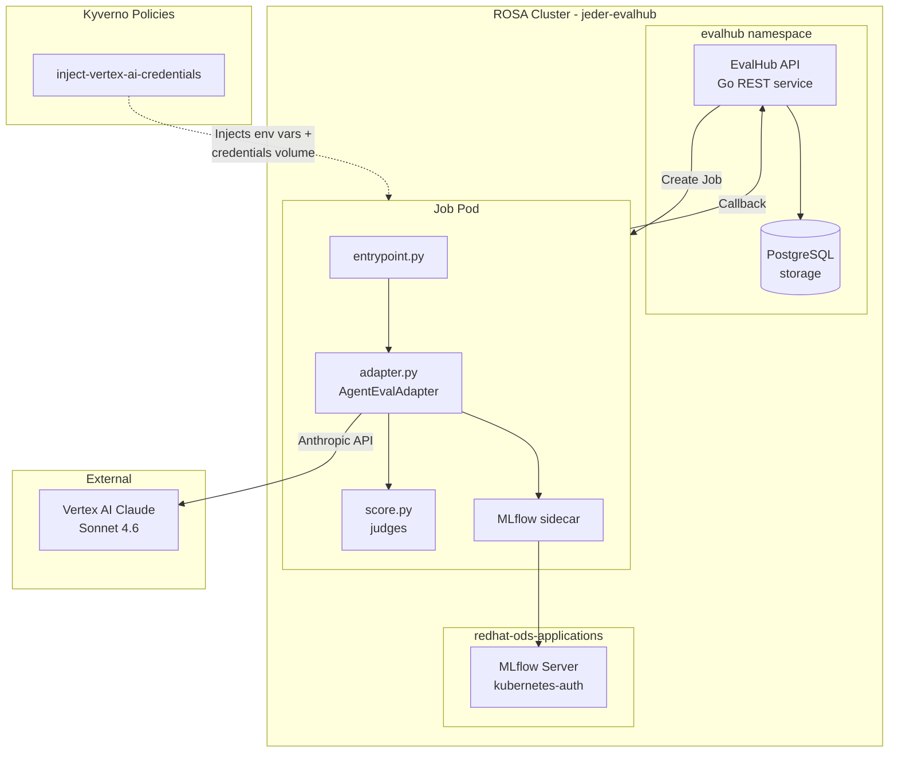

# EvalHub Agent-Eval Provider — Technical Report

## What This Is

A custom EvalHub provider that runs RFE quality assessments on RHOAI. Instead of evaluating LLMs against benchmarks (like lm-evaluation-harness), this provider evaluates *documents* — it calls Claude via Vertex AI to score RFEs against a rubric, then validates the output with inline judges.

## End-to-End Flow

### Step 1: Job Submission

### Step 2: Adapter Execution

### Step 3: Scoring Pipeline

### Step 4: MLflow Integration

## Infrastructure Diagram

## Architecture Alignment with EvalHub Spec

Reviewed against [opendatahub-io/architecture-context eval-hub.md](https://github.com/opendatahub-io/architecture-context/blob/main/architecture/rhoai-3.4/eval-hub.md):

### Aligned

| Requirement | Status | How |
|---|---|---|
| Adapter implements `FrameworkAdapter` | ✅ | `AgentEvalAdapter(FrameworkAdapter)` in adapter.py |
| Job spec at `/meta/job.json` | ✅ | entrypoint.py reads from `/meta/job.json` |
| Status callbacks via `JobCallbacks` | ✅ | Reports INITIALIZING → LOADING_DATA → RUNNING_EVALUATION → POST_PROCESSING → COMPLETED |
| Returns `JobResults` with `EvaluationResult` metrics | ✅ | results_mapper.py maps all metrics |
| MLflow via projected SA token | ✅ | Sidecar handles auth; adapter logs via `callbacks.mlflow.save()` |
| UBI9 base image | ✅ | `registry.access.redhat.com/ubi9/python-311:latest` |
| Non-root execution | ✅ | UBI9 python image runs as non-root by default |
| Provider registered via ConfigMap | ✅ | `deploy/evalhub/configmap-template.yaml` with TrustyAI labels |
| S3 dataset download | ✅ | `s3_dataset.py` with path traversal protection |

### Gaps / Workarounds

| Gap | Workaround | Filed |
|---|---|---|
| No parameter passthrough to benchmark pods | Kyverno ClusterPolicy injects Vertex AI creds | [#50](https://github.com/opendatahub-io/agent-eval-harness/issues/50) |
| No volume mount support in provider spec | Kyverno injects credentials volume | [#51](https://github.com/opendatahub-io/agent-eval-harness/issues/51) |
| No per-job env var injection | Kyverno policy — cannot vary per job | [#52](https://github.com/opendatahub-io/agent-eval-harness/issues/52) |
| Baked-in dataset is read-only | Copy to writable temp dir before execution | N/A — container design, not EvalHub gap |
| MLflow API requires SA token + workspace header | Adapter pod sidecar handles transparently; CLI access requires manual port-forward | [#55](https://github.com/opendatahub-io/agent-eval-harness/issues/55) |
| No job management CLI (list/delete/inspect) | Manual API calls via curl + SA token | [#56](https://github.com/opendatahub-io/agent-eval-harness/issues/56) |
| `overall_score` mixes bool/numeric judge scales | Set to None; individual metrics visible | Design issue in results_mapper, not EvalHub |
| No traces in MLflow (only metrics) | Follow-up: add `mlflow.anthropic.autolog()` | [#54](https://github.com/opendatahub-io/agent-eval-harness/issues/54) |

### Spec Items Not Applicable to This Provider

| Spec Item | Why N/A |
|---|---|
| OCI artifact export | Not wired — future work |
| S3 `testDataRef` init container | Using baked-in dataset, not S3-hosted |
| Model endpoint auth secret | Calls Vertex AI, not a model endpoint |
| Multi-tenant X-Tenant header | Single-tenant deployment |

## Test Runs

| Run | Date | Model | rubric_score | All judges pass? | MLflow run_id |
|---|---|---|---|---|---|
| Final (current) | 2026-05-05 15:16 | claude-sonnet-4-6 | 9/10 | ✅ 5/5 | `0e58068d...` |
| Reference (assess-rfe plugin) | 2026-05-03 04:10 | claude-sonnet-4-6 | 8/10 | N/A | N/A |

Variance (8 vs 9) is expected — LLM non-determinism on subjective rubric criteria (WHY, Right-sized).

## Open Issues

### Filed against [opendatahub-io/agent-eval-harness](https://github.com/opendatahub-io/agent-eval-harness/issues)

| Issue | Type | Description |
|---|---|---|
| [#50](https://github.com/opendatahub-io/agent-eval-harness/issues/50) | RFE | EvalHub should forward job parameters to benchmark pods |
| [#51](https://github.com/opendatahub-io/agent-eval-harness/issues/51) | RFE | EvalHub should support volume mounts in provider spec |
| [#52](https://github.com/opendatahub-io/agent-eval-harness/issues/52) | RFE | Per-job env var injection into benchmark pods |
| [#54](https://github.com/opendatahub-io/agent-eval-harness/issues/54) | Feature | Add MLflow tracing for adapter LLM calls |
| [#55](https://github.com/opendatahub-io/agent-eval-harness/issues/55) | Feature | Document RHOAI MLflow API authentication pattern |
| [#56](https://github.com/opendatahub-io/agent-eval-harness/issues/56) | Feature | Add job management commands to evalhub CLI integration |

### Filed against [eval-hub/eval-hub](https://github.com/eval-hub/eval-hub/issues)

| Issue | Type | Description |
|---|---|---|
| [#538](https://github.com/eval-hub/eval-hub/issues/538) | Bug | `evalhub eval run --wait` polls indefinitely after job completes |
